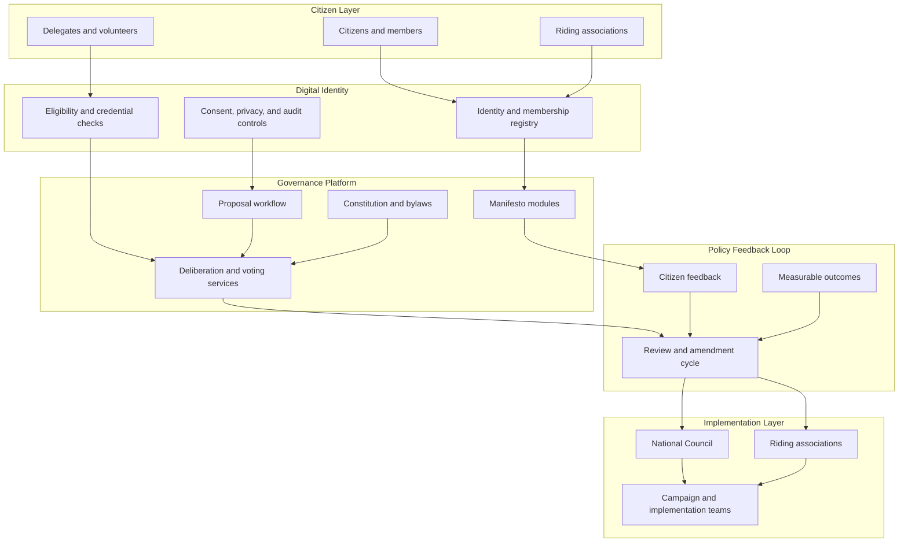
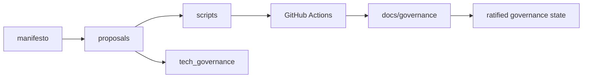

# Digital Democracy Architecture

This document describes the high-level operating model for the Peoples Potato
Party of Canada governance platform. It explains how citizens, digital identity,
policy workflows, and implementation bodies connect inside the repository and in
future platform design.

## Architecture Overview

## Citizen Layer

The citizen layer includes members, supporters, riding associations, delegates,
and volunteers. This is the participation surface of the system. It is where
ideas originate, where feedback is collected, and where democratic legitimacy is
formed.

Design goals:

- low barrier to participation
- regional accessibility
- bilingual and inclusive communication
- transparent feedback channels

## Digital Identity

The digital identity layer is responsible for membership records, eligibility,
consent, and auditability. In repository terms, this layer is represented by the
rules in `docs/governance/` and by proposal requirements that force identity and
eligibility assumptions to be made explicit.

Key functions:

- maintain trusted membership records
- support secure voting and consultation
- track consent and privacy boundaries
- preserve an audit trail for governance decisions

## Governance Platform

The governance platform is the authoring and decision environment. In the
repository, it is expressed through:

- `manifesto/` for policy articles
- `tech_governance/` for system addendums
- `proposals/` and `templates/` for change intake
- `docs/governance/` for formal authority and process
- `.github/workflows/` and `scripts/` for automated checks

This layer should be modular, reviewable, and easy to test.

## Policy Feedback Loop

The policy feedback loop turns political promises into an iterative system. Each
article and addendum should define measurable outcomes or validation targets so
future contributors can compare intent against results.

Loop stages:

1. propose a policy or change
2. gather citizen feedback
3. review constitutional, fiscal, and environmental impacts
4. adopt, reject, or revise the proposal
5. measure results and feed them back into the next cycle

## Implementation Layer

The implementation layer includes the National Council, riding associations,
campaign teams, and future delivery institutions. This is where approved policy
must move from text into operations, legislation, or public service design.

Implementation priorities:

- accountability for execution
- traceability from policy text to action
- publication of measurable outcomes
- periodic review against manifesto commitments

## Repository Mapping

The repository is intentionally split so policy, implementation, and
institutional authority can evolve without being collapsed into one file or one
approval path.
