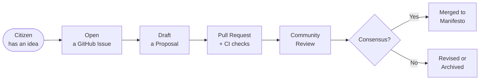

# Potato — Open Source Governance for Canada

**What if political policy worked like open-source software?**

This is a civic governance experiment. The manifesto, institutional rules, and
proposal process are stored as version-controlled text files. Changes are
proposed as pull requests, reviewed by contributors, validated by automated
checks, and merged when they reach consensus.

This repository is fictional — it is a reference experiment, not a registered
political party and not legal advice.

---



---

## Start here

| I want to... | Go to |
| --- | --- |
| Understand how the system works | [docs/how_to_participate.md](docs/how_to_participate.md) |
| Propose a policy idea | [Open a Policy Proposal issue](../../issues/new/choose) |
| Try a starter experiment | [experiments/](experiments/) |
| Read the manifesto | [manifesto/](manifesto/) |
| Understand the governance rules | [docs/governance/](docs/governance/) |
| See where the project is going | [ROADMAP.md](ROADMAP.md) |

---

## How it works

**1. Ideas start as issues**
Open a GitHub Issue using one of the templates. Describe a policy problem,
raise a question, or start a governance debate. No technical background needed.

**2. Issues become proposals**
Structured proposals live in `proposals/` and follow a standard template.
They describe the problem, the mechanism, the costs, and the constitutional
questions. Anyone can write one.

**3. Proposals become pull requests**
A PR against `manifesto/` or `docs/governance/` is how a proposal actually
changes the canonical policy text. Opening a PR triggers automated checks.

**4. Automated checks run on every PR**

```
Markdown lint          → are required headings present?
Proposal validation    → does the template have all sections?
Charter compliance     → are there potential rights conflicts to flag?
Policy consistency     → does this contradict existing manifesto text?
```

Checks flag issues for human review — they do not make decisions.

**5. Community review and deliberation**
Contributors read, comment, question, and endorse. Governance Reviewers
apply constitutional analysis. The goal is to improve proposals, not to block them.

**6. Merge**
When a proposal passes checks and reaches reviewer consensus, a Maintainer
merges it. The commit history is the permanent audit trail.

---

## Repository layout

```text
manifesto/            one file per manifesto article
civic_infrastructure/      civic technology addendums
experiments/          starter policy experiments for new contributors
proposals/            proposals under active development
templates/            canonical proposal template
docs/
  governance/         constitution, bylaws, and governance process
  adr/                Architecture Decision Records
  how_to_participate.md
  governance_roles.md
scripts/              local and CI validation scripts
.github/
  workflows/          automated governance checks
  ISSUE_TEMPLATE/     guided issue submission templates
AGENTS.md             collaboration contract for AI agents
ARCHITECTURE.md       system design and diagrams
ROADMAP.md            development phases
```

---

## Try the experiments

Not ready to propose a full policy change? Start in `experiments/`. These
are open questions with structured debate spaces — lower stakes than amending
the manifesto, and designed for first-time contributors.

- [Digital Referendums](experiments/digital_referendums.md) — should Canada
  have citizen-initiated referendums?
- [Housing Policy](experiments/housing_policy_experiment.md) — what combination
  of measures would reduce unaffordability without displacement?
- [Energy Strategy](experiments/energy_strategy_experiment.md) — how should
  Canada manage the energy transition fairly?

---

## Contributing

See [docs/how_to_participate.md](docs/how_to_participate.md) for the full
guide. The short version:

1. Open an issue or comment on an existing one
2. Copy `templates/proposal_template.md` to `proposals/your-title.md`
3. Fill in the required sections
4. Open a PR — CI checks run automatically
5. Respond to reviewer comments and revise

First-time contributors: the experiments folder is the best starting point.

---

## AI collaboration

This repository is designed for human contributors and AI agents working
together. The operational contract for AI agents lives in [AGENTS.md](AGENTS.md).

Agents assist with documentation, review analysis, and governance validation.
They do not merge PRs, do not change constitutional meaning without explicit
human approval, and must label their contributions clearly.

---

## Governance base layer

The constitutional foundation lives in `docs/governance/`. If manifesto text
conflicts with the constitutional layer, the constitutional documents control
until formally amended through the governance process.
