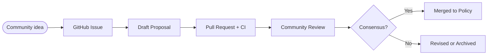

# Potato — Open Source Governance Framework

**An open-source governance framework that allows communities to build
transparent and collaborative political movements.**

Governance documents — constitutions, policy manifestos, bylaws, proposals —
are stored as version-controlled text files. Changes are proposed as pull
requests, reviewed by contributors, validated by automated checks, and merged
when they reach consensus.

This is a civic infrastructure experiment. It is not a registered political
party and not legal advice.

---



---

## Start here

| I want to... | Go to |
| --- | --- |
| Understand how the system works | [docs/how_to_participate.md](docs/how_to_participate.md) |
| Build a new governance instance | [INSTANCE_GUIDE.md](INSTANCE_GUIDE.md) |
| Propose a policy idea | [Open a Policy Proposal issue](../../issues/new/choose) |
| Try a starter experiment | [docs/experiments/](docs/experiments/) |
| Read the Canada manifesto | [instances/canada/manifesto/](instances/canada/manifesto/) |
| Understand the governance rules | [docs/governance/](docs/governance/) |
| See where the project is going | [ROADMAP.md](ROADMAP.md) |

---

## How it works

**1. Framework + instances**
The repository is split into a universal framework (`core/`) and
community-specific governance instances (`instances/`). The framework
provides templates and tooling. Instances provide the democratic content.

**2. Ideas start as issues**
Open a GitHub Issue using one of the templates. Describe a policy problem,
raise a question, or start a governance debate. No technical background needed.

**3. Issues become proposals**
Structured proposals follow the template in `core/proposal_system/`.
They describe the problem, the mechanism, the costs, and the rights questions.
Anyone can write one.

**4. Proposals become pull requests**
A PR against an instance's `manifesto/` or `governance/` is how a proposal
actually changes canonical policy. Opening a PR triggers automated checks.

**5. Automated checks run on every PR**

```
Markdown lint          → are required headings present?
Proposal validation    → does the template have all sections?
Compliance check       → are there potential rights conflicts to flag?
Policy consistency     → does this contradict existing policy?
```

**6. Merge**
When a proposal passes checks and reaches reviewer consensus, a Maintainer
merges it. The commit history is the permanent audit trail.

---

## Repository layout

```text
core/
  manifesto_template/   universal article structure and templates
  governance_protocol/  how governance processes work
  proposal_system/      how proposals are submitted and reviewed
  governance_cycles/    how policy evolves through iterative cycles

instances/
  canada/               Peoples Potato Party of Canada (reference implementation)
    manifesto/          Canadian policy articles
    governance/         → see docs/governance/ (canonical location)

civic_infrastructure/   universal civic technology addendums
docs/
  experiments/          open policy questions and interaction experiments
  governance/           Canada instance constitution and bylaws
  adr/                  Architecture Decision Records
  how_to_participate.md
  governance_roles.md
scripts/                CI validation scripts
.github/
  workflows/            automated governance checks
  ISSUE_TEMPLATE/       guided issue submission templates
AGENTS.md               AI agent collaboration contract
ARCHITECTURE.md         system design and diagrams
INSTANCE_GUIDE.md       how to build a new governance instance
ROADMAP.md              development phases
```

---

## Try the experiments

Not ready to propose a full policy change? Start in `docs/experiments/`. These
are open questions with structured debate spaces — lower stakes than amending
the manifesto, and designed for first-time contributors.

- [Digital Referendums](docs/experiments/digital_referendums.md) — should
  communities have citizen-initiated referendums?
- [Housing Policy](docs/experiments/housing_policy_experiment.md) — what
  combination of measures reduces unaffordability without displacement?
- [Energy Strategy](docs/experiments/energy_strategy_experiment.md) — how should
  a community manage an energy transition fairly?

---

## Build your own instance

Fork this repository and follow [INSTANCE_GUIDE.md](INSTANCE_GUIDE.md) to
create a governance instance for your own community. The Canada instance
(`instances/canada/`) is a complete worked example.

Any community can use this framework: a political party, a civic movement,
a residents' association, a cooperative, or any group that wants to make
collective decisions through an open, auditable process.

---

## Contributing

See [docs/how_to_participate.md](docs/how_to_participate.md) for the full
guide. The short version:

1. Open an issue or comment on an existing one
2. Copy `core/proposal_system/proposal_template.md` to your instance's
   `proposals/` directory
3. Fill in the required sections
4. Open a PR — CI checks run automatically
5. Respond to reviewer comments and revise

---

## AI collaboration

This repository is designed for human contributors and AI agents working
together. The operational contract for AI agents lives in [AGENTS.md](AGENTS.md).

Agents assist with documentation, review analysis, and governance validation.
They do not merge PRs, do not change constitutional meaning without explicit
human approval, and must label their contributions clearly.
